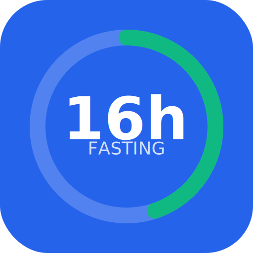

# FastTrackr - Intermittent Fasting Timer 🍽️⏰

<div align="center">
  
  
  **Simple and effective 16:8 intermittent fasting tracker**
  
  Monitor your fasting progress with beautiful circular timers and detailed history.
  
  [](https://opensource.org/licenses/MIT)
  [](https://reactjs.org/)
  [](https://mui.com/)
  [](https://web.dev/progressive-web-apps/)
</div>

## ✨ Features

### 🎯 **Core Functionality**
- **16:8 Intermittent Fasting Timer** - Optimized for the popular 16-hour fasting protocol
- **Circular Progress Visualization** - Beautiful ring progress bars that fill as you fast
- **Dual Time Display** - Click to toggle between elapsed time and remaining time
- **Smart Notifications** - Get notified when your fast completes and at milestones
- **Fast Confirmation** - Prevents accidental fast termination with confirmation dialogs

### 📊 **Tracking & Analytics**
- **Comprehensive History** - View all your completed fasts with detailed metrics
- **Statistics Dashboard** - Track completion rates, streaks, and progress over time
- **Data Export/Import** - Backup and restore your fasting data
- **Progress Tracking** - Visual indicators for target achievement and extended fasts

### 🎨 **User Experience**
- **Dark Mode Support** - Toggle between light and dark themes
- **Progressive Web App** - Install on mobile devices like a native app
- **Responsive Design** - Works perfectly on desktop, tablet, and mobile
- **Offline Support** - Continue tracking even without internet connection

### ⚙️ **Customization**
- **Flexible Durations** - 12h, 16h, 18h, 20h, 24h, or custom duration fasts
- **Notification Settings** - Configure fast completion and milestone alerts
- **Data Management** - Clear data, export for backup, import from other devices

## 🚀 Quick Start

### Prerequisites
- Node.js 16.0 or higher
- npm or yarn package manager

### Installation

1. **Clone the repository**
   ```bash
   git clone https://github.com/yourusername/fasttrackr.git
   cd fasttrackr
   ```

2. **Install dependencies**
   ```bash
   npm install
   ```

3. **Start the development server**
   ```bash
   npm run dev
   ```

4. **Open your browser**
   - Navigate to `http://localhost:3000`
   - The app will automatically reload when you make changes

### Building for Production

```bash
# Build the app for production
npm run build

# Preview the production build
npm run preview
```

### Generating Icons

If you modify the base icon (`public/icons/icon-base.svg`):

```bash
npm run icons
```

## 📱 Usage

### Starting Your First Fast

1. **Choose Duration**: Select from preset durations (16h recommended) or set a custom time
2. **Start Timer**: Click "Start Fast" to begin tracking
3. **Monitor Progress**: Watch the circular progress bar fill as you fast
4. **Toggle Display**: Click the timer to switch between elapsed and remaining time
5. **Complete Fast**: Your fast automatically completes when target is reached, or stop manually

### Key Interactions

- **⏱️ Timer Click**: Toggle between elapsed/remaining time display
- **🛑 Stop Fast**: Confirmation dialog prevents accidental stops
- **🔄 Extended Fasts**: Continue beyond target with visual indicators
- **📊 View History**: Track your fasting journey over time
- **⚙️ Settings**: Customize notifications, theme, and data management

## 🛠️ Technology Stack

### Frontend
- **React 18** - Modern React with hooks and concurrent features
- **Material-UI 5** - Google's Material Design component library
- **Vite** - Lightning-fast build tool and development server

### PWA Features
- **Service Worker** - Offline caching and background sync
- **Web App Manifest** - Native app-like installation
- **Push Notifications** - Fast completion and milestone alerts

### Data Storage
- **LocalStorage** - Client-side data persistence
- **JSON Export/Import** - Portable data backup format

### Development Tools
- **ESLint** - Code linting and style enforcement
- **Hot Module Replacement** - Instant development feedback

## 📁 Project Structure

```
fasttrackr/
├── public/
│   ├── icons/           # App icons and splash screens
│   ├── manifest.json    # PWA manifest
│   └── sw.js           # Service worker
├── src/
│   ├── components/     # React components
│   │   ├── TimerScreen.jsx
│   │   ├── HistoryScreen.jsx
│   │   ├── StatsScreen.jsx
│   │   └── SettingsScreen.jsx
│   ├── hooks/          # Custom React hooks
│   │   ├── useFastTimer.jsx
│   │   └── useNotifications.jsx
│   ├── App.jsx         # Main app component
│   └── main.jsx        # App entry point
├── package.json
└── vite.config.js      # Vite configuration
```

## 🎯 Key Design Decisions

### Why 16:8 Focus?
The 16:8 method (16 hours fasting, 8 hours eating) is the most popular and scientifically-backed intermittent fasting protocol. FastTrackr optimizes for this while supporting other durations.

### No Pause Functionality
Fasting is binary - you're either fasting or not. "Pausing" a fast doesn't align with the biological reality of metabolic processes, so we removed this confusing feature.

### Circular Progress Design
Visual progress representation mimics a clock, making time progression intuitive and engaging for users tracking long-duration activities.

## 🤝 Contributing

We welcome contributions! Here's how you can help:

### Development Setup
1. Fork the repository
2. Create a feature branch: `git checkout -b feature/amazing-feature`
3. Make your changes
4. Commit with conventional commits: `git commit -m "feat: add amazing feature"`
5. Push to your branch: `git push origin feature/amazing-feature`
6. Open a Pull Request

### Commit Convention
We use [Conventional Commits](https://www.conventionalcommits.org/):
- `feat:` - New features
- `fix:` - Bug fixes
- `docs:` - Documentation changes
- `style:` - Code style/formatting
- `refactor:` - Code refactoring
- `test:` - Adding tests
- `chore:` - Maintenance tasks

### Areas for Contribution
- 🌐 **Internationalization** - Add multi-language support
- 📊 **Advanced Analytics** - More detailed statistics and insights
- 🔄 **Data Sync** - Cloud synchronization across devices
- 🎨 **Themes** - Additional color schemes and customization
- 📱 **Mobile App** - React Native companion app
- 🧪 **Testing** - Unit and integration tests

## 📄 License

This project is licensed under the MIT License - see the [LICENSE](LICENSE) file for details.

## 🙏 Acknowledgments

- **Material-UI Team** - For the excellent component library
- **Vite Team** - For the blazing-fast build tool
- **React Team** - For the amazing framework
- **IF Community** - For inspiration and feedback on intermittent fasting practices

## 📞 Support

- **Issues**: [GitHub Issues](https://github.com/yourusername/fasttrackr/issues)
- **Discussions**: [GitHub Discussions](https://github.com/yourusername/fasttrackr/discussions)

---

<div align="center">
  <strong>Happy Fasting! 🍽️⏰</strong>
  
  Made with ❤️ for the intermittent fasting community
</div> 